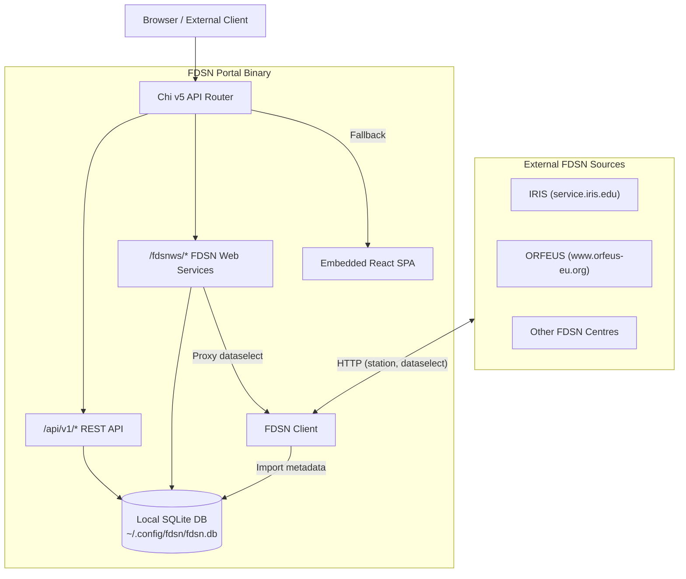
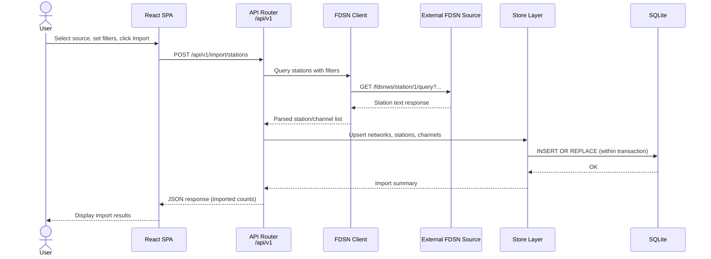
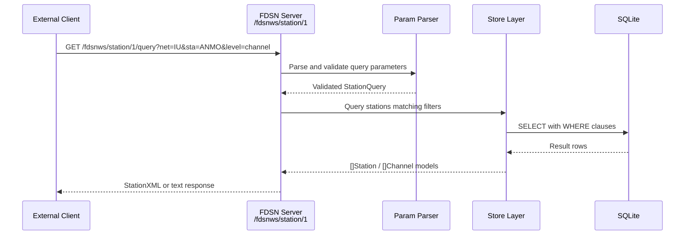
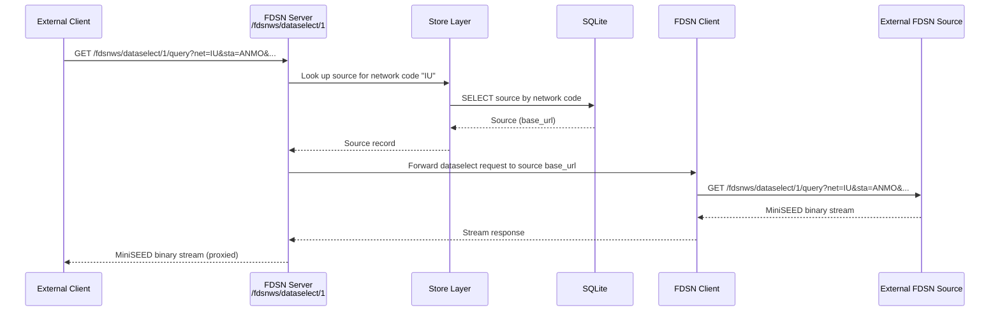

# Architecture

FDSN Portal is a self-contained Go application that bundles a React single-page application, an SQLite database, and both REST and FDSN-standard web-service endpoints into a single binary. It acts as a metadata aggregator -- connecting to external FDSN data centres to import station, network, and channel metadata, persisting that data locally, and re-serving it through standards-compliant FDSN web-service endpoints. This page describes the system design, project layout, database schema, and key request flows.

## High-Level Architecture

The following diagram shows the major components and how they interact. Everything inside the "FDSN Portal Binary" box ships as a single executable with no external dependencies.



!!! info "Single-binary deployment"

    FDSN Portal compiles the React frontend into the Go binary using `go:embed`. The resulting executable contains the HTTP server, the embedded SPA, and a pure-Go SQLite driver (`modernc.org/sqlite`) -- no CGO, no Node.js runtime, no external database server. Copy the binary to any machine where Go runs and start it with `fdsn serve`.

## Technology Stack

| Component | Technology |
|-----------|------------|
| Language | Go |
| CLI framework | Cobra |
| Configuration | Viper (YAML file, env vars, CLI flags) |
| HTTP router | chi v5 |
| Database | SQLite via modernc.org/sqlite (pure Go, no CGO) |
| Database access | sqlx |
| Logging | zerolog |
| Frontend framework | React 19 |
| Routing (frontend) | React Router 7 |
| Server state | TanStack React Query |
| UI components | shadcn/ui + Radix UI |
| CSS | Tailwind CSS 4 |
| Maps | Leaflet + React Leaflet |
| Waveforms | seisplotjs |
| Frontend tooling | Bun |
| Frontend embed | `go:embed` of `ui/dist/` |

## Package Structure

```
main.go                    -- Entry point, injects version info, calls cmd.Execute()
cmd/
  root.go                  -- Root cobra command, viper init, logging setup
  serve.go                 -- "fdsn serve" command, starts HTTP server
  config.go                -- "fdsn config init" command
  version.go               -- "fdsn version" command
internal/
  config/config.go         -- Config dirs, defaults (viper), save
  api/
    router.go              -- Chi router: /api/v1 routes + /fdsnws mount + SPA fallback
    respond.go             -- JSON response helpers
    sources.go             -- CRUD for FDSN sources
    explore.go             -- Explore external stations
    import.go              -- Import stations from external source
    stations.go            -- Local station management + networks
    stats.go               -- Dashboard statistics
    waveforms.go           -- MiniSEED proxy
  fdsnserver/
    server.go              -- Chi sub-router for /fdsnws/* endpoints
    station.go             -- FDSN station service (text + XML)
    dataselect.go          -- FDSN dataselect (proxies upstream)
    availability.go        -- FDSN availability (query + extent)
    params.go              -- Parameter parsing, wildcard matching
    wadl.go                -- WADL descriptors
  fdsnclient/
    client.go              -- HTTP client for external FDSN sources (60s timeout)
    station.go             -- Station/channel query + text parsing
    dataselect.go          -- FetchMiniSEED from external source
  models/
    models.go              -- Data models: Source, Network, Station, Channel, Availability, Stats
    stationxml.go          -- StationXML output structures
  store/
    store.go               -- Store interfaces (SourceStore, StationStore, AvailabilityStore, StatsStore)
    source_store.go        -- SQLite-backed SourceStore
    station_store.go       -- SQLite-backed StationStore + StatsStore
    availability_store.go  -- SQLite-backed AvailabilityStore
  database/
    database.go            -- DB open (WAL mode, foreign keys, busy timeout), migration runner
    migrations.go          -- Embedded migrations FS
    migrations/001_initial.sql -- Core schema
  ui/
    embed.go               -- Embeds ui/dist/ for SPA serving
ui/                         -- React/Bun frontend source
```

**Key packages at a glance:**

- **`cmd/`** -- Cobra commands that wire together configuration, logging, and the HTTP server.
- **`internal/api/`** -- REST API handlers for the web UI (sources CRUD, station import, explore, stats, waveform proxy). Mounts the FDSN sub-router and serves the embedded SPA as a catch-all fallback.
- **`internal/fdsnserver/`** -- Standards-compliant FDSN web-service endpoints (`/fdsnws/station`, `/fdsnws/dataselect`, `/fdsnws/availability`). These serve data from the local database or proxy upstream for waveform data.
- **`internal/fdsnclient/`** -- HTTP client that talks to external FDSN data centres. Used during station exploration and import, and for proxying dataselect requests.
- **`internal/models/`** -- Shared data types used across all layers.
- **`internal/store/`** -- Data access layer. Defines store interfaces and provides SQLite-backed implementations using sqlx.
- **`internal/database/`** -- Database lifecycle: opening the connection (with WAL mode, foreign keys, busy timeout), and running embedded SQL migrations.
- **`internal/ui/`** -- A single `embed.go` file that makes the compiled React frontend available to the Go binary at build time.

## Database Schema

The local SQLite database consists of five tables with cascading foreign-key relationships. All metadata flows from a configured **source** down through **networks**, **stations**, and **channels** to optional **availability** records.

```mermaid
erDiagram
    sources {
        integer id PK
        text name UK
        text base_url
        text description
        integer enabled
        datetime created_at
        datetime updated_at
    }

    networks {
        integer id PK
        integer source_id FK
        text code
        text description
        datetime start_time
        datetime end_time
        datetime created_at
    }

    stations {
        integer id PK
        integer network_id FK
        text code
        real latitude
        real longitude
        real elevation
        text site_name
        datetime start_time
        datetime end_time
        datetime created_at
    }

    channels {
        integer id PK
        integer station_id FK
        text location_code
        text code
        real latitude
        real longitude
        real elevation
        real depth
        real azimuth
        real dip
        text sensor_description
        real scale
        real scale_freq
        text scale_units
        real sample_rate
        datetime start_time
        datetime end_time
        datetime created_at
    }

    availability {
        integer id PK
        integer channel_id FK
        datetime earliest
        datetime latest
        datetime updated_at
    }

    sources ||--o{ networks : "has"
    networks ||--o{ stations : "has (CASCADE)"
    stations ||--o{ channels : "has (CASCADE)"
    channels ||--o{ availability : "has (CASCADE)"
```



**Schema notes:**

- **Unique constraints** prevent duplicate records: `sources.name`, `networks(source_id, code, start_time)`, `stations(network_id, code, start_time)`, `channels(station_id, location_code, code, start_time)`.
- **Cascading deletes** are enabled on `stations -> channels -> availability`. Note that the `networks.source_id` foreign key does **not** cascade, so deleting a source will not automatically remove its networks. Deleting a network does cascade through stations, channels, and availability.
- **SQLite configuration:** WAL journal mode for concurrent reads, foreign keys enforced, 5-second busy timeout, `MaxOpenConns=1`.

## Request Flows

### Station Import Flow

When a user imports stations from an external data centre through the web UI, the following sequence occurs:



### FDSN Station Query

External clients (or the built-in FDSN Query Tester) query the local station metadata through the standard FDSN station endpoint:



### Dataselect Proxy

The dataselect endpoint does not serve waveform data from the local database. Instead, it identifies the upstream source for the requested network and proxies the request to the original FDSN data centre:



This proxy approach means FDSN Portal does not need to store waveform data locally while still providing a unified query interface across all configured sources.
