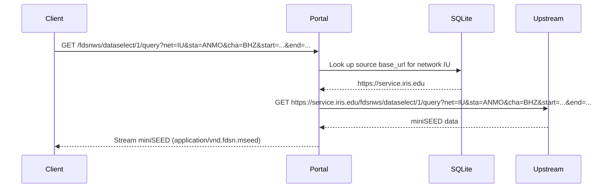

# Dataselect Service

**Endpoint:** `/fdsnws/dataselect/1/query`
**Version:** 1.1.0

## Overview

The dataselect service returns waveform data in miniSEED format. Unlike the station service which queries data stored locally, the dataselect service **proxies requests to the upstream FDSN data centre** that originally provided the network data. The portal looks up the source data centre for the requested network in its local database and forwards the request to that upstream service.

## Proxy Behavior

When a dataselect request is received, the portal resolves the upstream data centre from its local database and forwards the request transparently.



## Parameters

| Parameter | Type | Required | Description |
|-----------|------|----------|-------------|
| network / net | string | Yes | Network code |
| station / sta | string | Yes | Station code |
| channel / cha | string | Yes | Channel code |
| location / loc | string | No | Location code (default: empty) |
| starttime / start | datetime | Yes | Start of time window |
| endtime / end | datetime | Yes | End of time window |

## Examples

Request 10 minutes of BHZ data from IU.ANMO:

```bash
curl -o output.mseed "http://localhost:8080/fdsnws/dataselect/1/query?net=IU&sta=ANMO&loc=00&cha=BHZ&start=2024-01-15T00:00:00&end=2024-01-15T00:10:00"
```

Request data with a specific location code:

```bash
curl -o output.mseed "http://localhost:8080/fdsnws/dataselect/1/query?net=IU&sta=CCM&loc=10&cha=BHZ&start=2024-01-15T00:00:00&end=2024-01-15T00:10:00"
```

!!! important
    The requested network must exist in the local database so the portal can determine which upstream data centre to proxy the request to. If the network is not found locally, the service will return an error. Use the [Station Explorer](../web-ui/explorer.md) or `fdsn import` CLI command to import network metadata before making dataselect requests.

!!! note
    The response is streamed directly from the upstream data centre. The portal does not cache or store waveform data locally. Response times depend on the upstream service's performance and the amount of data requested.
