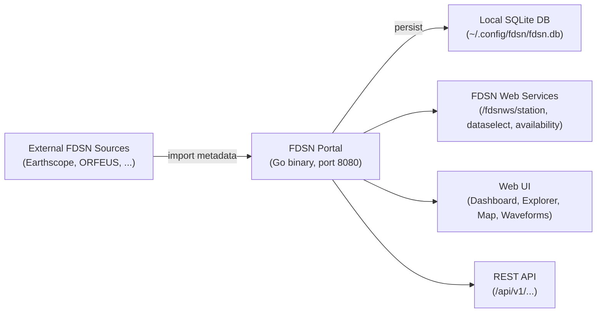

# FDSN Portal

**Seismic station metadata management -- import, explore, and re-serve FDSN data from a single binary.**

## Overview

FDSN Portal is a Go + React application that connects to external FDSN (International Federation of Digital Seismograph Networks) data centres such as Earthscope and ORFEUS, imports station, network, and channel metadata into a local SQLite database, and re-serves that data through standard FDSN web-service endpoints. The entire stack -- backend, database, and frontend -- ships as a single binary with zero external dependencies.

The embedded React UI provides an interactive dashboard, station explorer with filtering, a Leaflet-based map view, and a waveform viewer powered by seisplotjs. Configuration is managed through a YAML file at `~/.config/fdsn/config.yaml`, with support for environment variable overrides and CLI flags via Viper and Cobra.

Whether you are building a local seismic data cache, prototyping against FDSN services, or need a lightweight station metadata browser, FDSN Portal gives you a self-contained tool that runs anywhere Go runs.

## Key Features

- **Single binary deployment** -- Go backend with an embedded React UI (shadcn/ui components), nothing else to install
- **Zero external dependencies** -- pure-Go SQLite driver (no CGO), no separate database server required
- **Connect to any FDSN data centre** -- Earthscope (`service.iris.edu`), ORFEUS (`www.orfeus-eu.org`), and any other standards-compliant source
- **Import and manage station/network/channel metadata locally** -- query remote catalogues and store results in `~/.config/fdsn/fdsn.db`
- **Standard FDSN web-service endpoints** -- `/fdsnws/station`, `/fdsnws/dataselect`, and `/fdsnws/availability`
- **Interactive web UI** -- dashboard, station explorer, interactive map (Leaflet), and waveform viewer (seisplotjs)
- **Flexible configuration** -- YAML config file, environment variables, and CLI flags with clear precedence rules

## How It Works

!!! info "Default port"

    FDSN Portal listens on port **8080** by default. Visit `http://localhost:8080` after starting the server to open the web UI.

## Quick Links

| Section | Description |
|---------|-------------|
| [Getting Started](getting-started/index.md) | Installation, first run, and quickstart walkthrough |
| [Configuration](configuration.md) | Config file, environment variables, and CLI flag reference |
| [Web UI Guide](web-ui/index.md) | Dashboard, station explorer, map view, and waveform viewer |
| [FDSN Web Services](fdsn-services/index.md) | Station, dataselect, and availability endpoint documentation |
| [CLI Reference](cli-reference.md) | All `fdsn` subcommands and flags |
| [API Reference](api-reference.md) | REST API endpoints and request/response formats |
| [Architecture](architecture.md) | System design, project layout, and tech stack details |
| [Development](development/index.md) | Contributing guidelines and local development setup |
