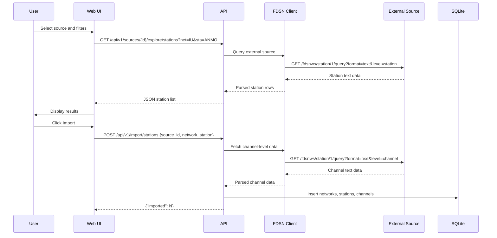

# Station Explorer

**Route:** `/explorer`

## Overview

The Station Explorer lets you search for stations on external FDSN data centres and import them into your local database. This is the primary workflow for populating your FDSN Portal instance with station metadata.

## Search Filters

The following filters are available when querying an external data centre:

| Filter | Description | Example |
|--------|-------------|---------|
| Source | Select which FDSN data centre to query | IRIS, ORFEUS |
| Network | Network code, supports wildcards (`*` and `?`) | `IU`, `US`, `I*` |
| Station | Station code, supports wildcards | `ANMO`, `CCM`, `A*` |
| Channel | Channel code, supports wildcards | `BHZ`, `BH?`, `*` |
| Location | Location code, supports wildcards | `00`, `10`, `--` |
| Geographic bounds | Bounding box defined by minlat, maxlat, minlon, maxlon | `minlat=30&maxlat=50` |

## Explore and Import Workflow

The following diagram illustrates the full explore-and-import sequence:

## Import Process

When you click Import on a station, the portal fetches channel-level detail from the external FDSN source and stores the resulting networks, stations, and channels in the local SQLite database.

The import is idempotent -- re-importing the same station updates existing records based on unique constraints (network code, station code, channel code, and location code). This means you can safely re-import stations to refresh their metadata without creating duplicate entries.

!!! tip
    Use wildcards for broader searches. For example, setting network to `IU` and station to `*` will return all stations in the IU (Global Seismograph Network) network. Similarly, `BH?` as a channel filter matches all broadband high-gain channels (`BHZ`, `BHN`, `BHE`).
