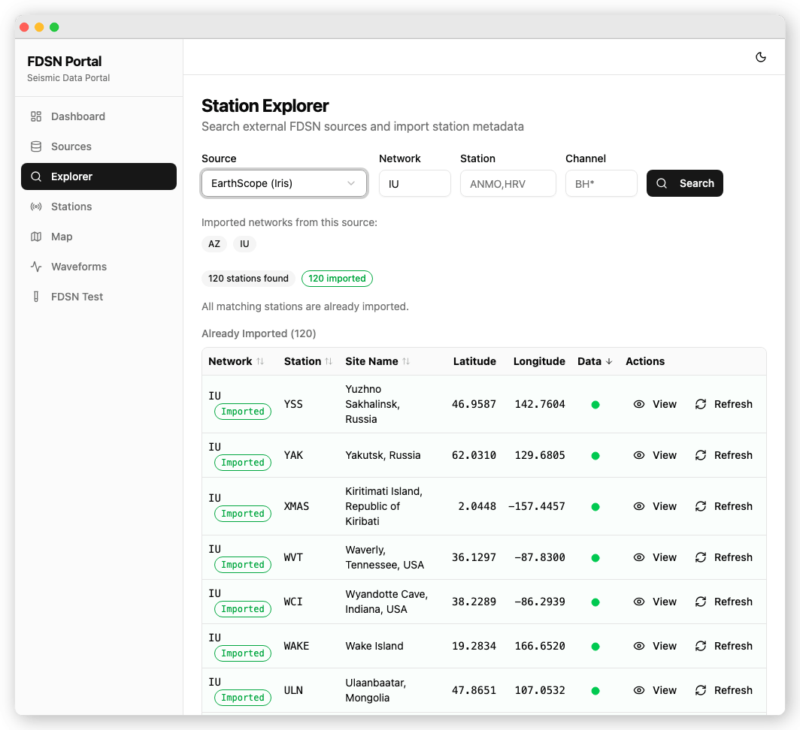
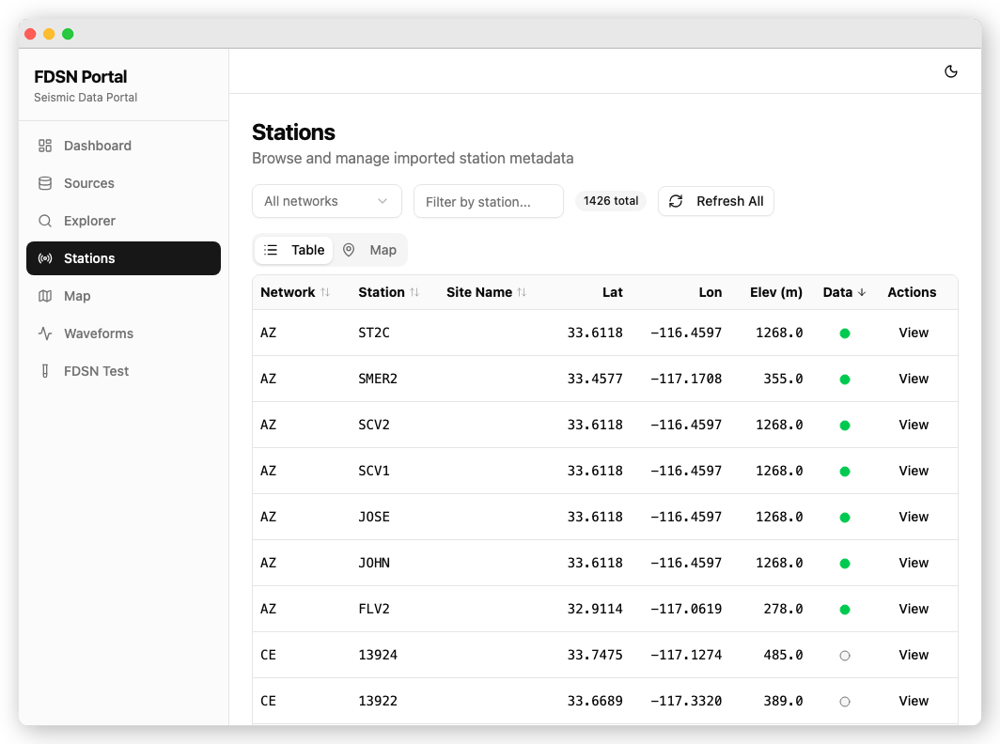
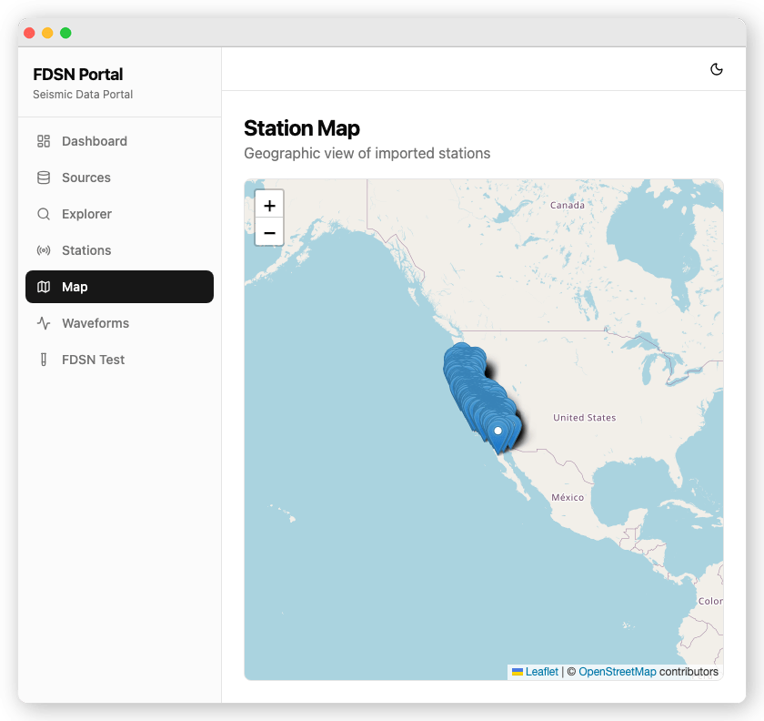
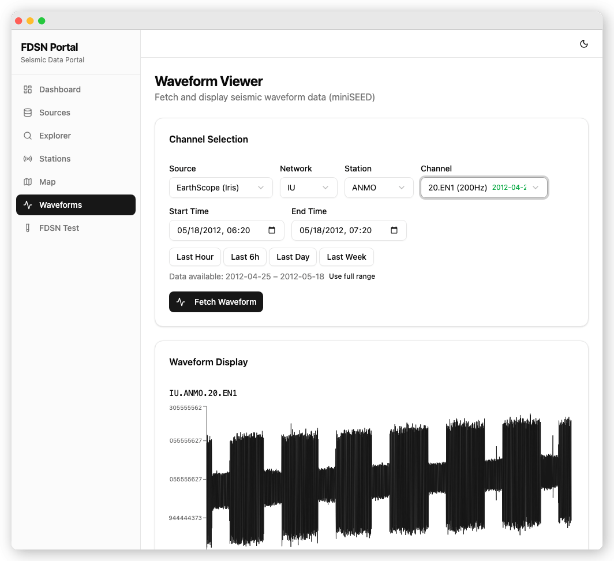

# Web UI Guide

## Overview

FDSN Portal includes an embedded web interface served directly from the Go binary. No separate frontend deployment is needed. Once the server is running, access the UI at [http://localhost:8080](http://localhost:8080).

The interface is built with React 19, React Router 7, shadcn/ui, Tailwind CSS, Leaflet maps, and seisplotjs for waveform rendering.

## Pages

The following pages are available in the web interface:

| Route | Page | Description |
|-------|------|-------------|
| `/` | [Dashboard](dashboard.md) | At-a-glance statistics for sources, networks, stations, and channels |
| `/sources` | [Sources](sources.md) | Manage FDSN data centre connections |
| `/explorer` | [Station Explorer](explorer.md) | Search external FDSN data centres and import station metadata |
| `/stations` | Stations | Browse imported stations with filtering and sorting |
| `/stations/:id` | Station Detail | View station details including channel inventory |
| `/map` | Map | Interactive Leaflet map showing station locations |
| `/waveforms` | Waveform Viewer | Visualize seismic waveform data using seisplotjs |
| `/fdsn` | FDSN Endpoint Tester | Test FDSN web service endpoints directly |

!!! tip
    The UI uses client-side routing, so all routes listed above are handled by the single-page application (SPA). The Go server returns the same `index.html` for any path that does not match an API route or static asset, allowing React Router to resolve the page on the client side.

## Page Screenshots

### [Dashboard](dashboard.md)

### [Sources](sources.md)

### [Station Explorer](explorer.md)

### [Station Browser](stations.md)

### [Station Detail](stations.md)

### [Interactive Map](map.md)

### [Waveform Viewer](waveforms.md)

### [FDSN Query Tester](fdsn-tester.md)

